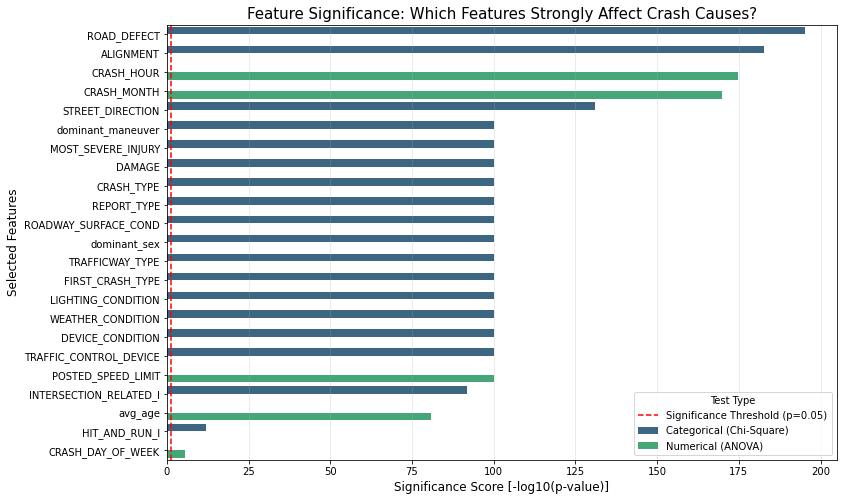
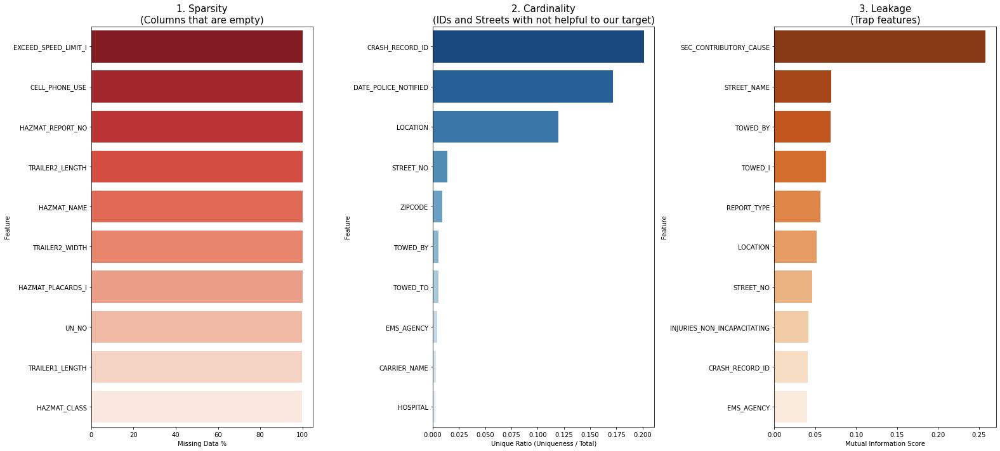

# Chicago-crash-cause-prediction
Predicting primary contributory causes of traffic crashes using machine learning.
## REPOSITORY STRUCTURE
- Data folder - where the datasets are stored
- Notebook folder - containing the ipynb notebook
- Non- technical deliverables folder - contains powerpoint.pdf and tableau interactive dashboard
- images folder- where the images used in readme and the notebook are stored
- Readme.md
- gitignore
- gitattributes
- Requirements.txt
- Interactive dashboard link: https://public.tableau.com/app/profile/grace.waweru/viz/Tableaudashboard_17767855045990/Dashboard1?publish=yes

## REPRODUCIBILITY
This is a guide on how to reproduce the analysis and model result found in this repository. Please follow the steps below
1. Clone the repository 
First clone this project to your local machine using gitbash
First clone this repository to your local machine using gitbash:
git clone https://github.com/ChairoSolutions/Chicago-crash-cause-prediction/tree/master
2. Setup an environment
The project requires python. Use a virtual environment to avoid library errors
The requirements.txt contains the specific versions of our libraries
pip install -r requirements.txt
3. Libraries 
The following are python libraries that are required for this analysis
- Loading and exploring the datasets - Pandas, numpy and scipy
- Machine learning and evaluation - scikitlearn 
- Interpretability - Shap
- Visualization - matpotlib and seaborn
- Deployment - Joblib
4. Data
Our data is sourced from the Chicago Data Portal. You should download the three csv datasets and place them in the data folder. The link attached has Traffic crashes, Vehicles and people
https://drive.google.com/drive/folders/1L_vsEDUWbOdqdFWgnFicctt0_qf8XXB9?usp=drive_link
5. Target Variable 
We used PRIM_CONTRIBUTORY_CAUSE 
 

## PROJECT FLOW
1. Business Understanding - Problem statement, goal, objectives, identifying our stakeholders
2. Data understanding - to gain insights in the data we are using
3. Data Processing - Selecting a target variable
4. Feature engineering - Selecting the features that strongl affect our target variable, ignoring features that have high cardinality and contribute to overfitting of our modes 
5. Pipeline - train test split, cleaning the datasets, normalizing our numerical features and encoding the categorical features
6. Modeling- Building different models 
7. Evaluation- Building a reusable code for evaluation and using different metrics to identify which model performs better on both training and testing 
8. Deployment - Deploting our model for our stake holders

# BUSINESS UNDERSTANDING
Chicago has been experiencing an uplift in traffic accidents. The city aims to eliminate fatalities but the data collected is very biased due to multiple post crash occurences. The project aims to develop a machine learning model that predicts the primary contributory cause of traffic crashes in Chicago, enabling stakeholders to identify high-risk conditions and design targeted interventions to improve road safety.

## Objectives
- Build a classification model to predict crash causes
- Identify key factors contributing to traffic accidents
- Provide insights that can help reduce accidents

##  Stakeholders
- Chicago City Planners → prioritize infrastructure improvements (e.g., intersections, lighting)
- Traffic Safety Authorities → design targeted safety campaigns and enforcement strategies
- Policy Makers → implement data-driven regulations to reduce high-risk crash scenarios

## Analytical Approach
This problem is framed as a **multi-class classification task**, where the target variable is:

PRIM_CONTRIBUTORY_CAUSE

## Success Criteria
The success of the model will be evaluated using:
- Macro F1-score (to handle class imbalance)
- Confusion matrix (to understand misclassifications)
- Interpretability (feature importance analysis)
- Baseline comparison (e.g., majority class or simple model)

## Key Challenges
- Imbalanced target classes
- High number of categorical variables
- Data spread across multiple tables (crashes, vehicles, people)
- Risk of data leakage: Some variables may contain information that is only known after the crash occurs (e.g., injury severity, damage estimates). These must be carefully excluded to avoid data leakage and ensure the model reflects real-world prediction scenarios.

# DATA UNDERSTANDING
The datasets we are using have been obtained from Chicago Data Portal. It contains Traffic crashes, vehicle and driver/passenger data from January 2024 to present. It is particulary useful because it includes all the factors influencing the crashes. It allows us to analyze patterns in traffic accidents.

### Dataset Description
This project uses three datasets provided by the City of Chicago:

- **Crashes Dataset**: Contains information about each traffic crash (e.g., time, location, weather conditions, road conditions).
- **Vehicles Dataset**: Contains details about the vehicles involved in each crash.
- **People Dataset**: Contains information about drivers and passengers involved in each crash.

These datasets are related through a common key: `CRASH_RECORD_ID`.

## Methodology

## Data Preparation

### Unit of Analysis
The primary unit of analysis will be at the crash level. Therefore, vehicle-level and person-level data will need to be aggregated to align with the crash-level target variable.

### Target Refinement
The unable to determine category and not applicable categories were excluded to ensure the model focuses on actionable causes

### Data Leakage Prevention 
We identified and excluded the post crash features, high cardinality features, IDs, rare features , weak features and severity indicators to ensure the model reflects on prediction scenarios

### Feature Selection
We selected the following features for succesful modelling and evaluation: 
- Age
- Sex
- Lighting condition- impacts visibility. The model uses thie to weigh the driver vision. Wha it during the day or was it at night, was it bare darkness or there were street lights
- Weather condition - was it raining, was it snowing , was it foggy, was it windy. All these increases the likelihood of a crash. Was the driver following too closely or was he/she speeding 
- Alignment - Describes the road. Is it straight or bending or narrowing or meandering. These are more likely to be associated with crah causes
- Traffic way type -This helps the model underatand the the flow of traffice and the common conflict point i.e is it a one way, two way etc
- Posted speed limit - This ia s critical feature. It allows the model see if the primary cause of accidents is exceeding the speed limit
- Vehicle type
- Physical condition - describes the state of the driver. Were they fatigued, ill, impared, driving under thr influence
- Driver action - This are the errors made by the driver to cause the crash, is it overtaking, overlapping etc
- Traffic control device - 
- Device condition
- Maneuver - Describes what the vehicle was doing eg: u-turn or improper reversing etc
- Driver condition - it provides a baseline for the drivers readiness
- Driver vision - Explains what obscured the drivers view. What is a building, windshield condition or other vehicles. It tells the model why the driver took the wrong action
- Crash month
- Crash day of the week

### Data Structure Inspection

Before performing exploratory analysis, we examine the structure of each dataset, including:
- Column names and meanings
- Data types
- Missing values
- Summary statistics

This helps identify data quality issues and informs preprocessing decisions.

### Key Observations from Data Structure Inspection

- The crashes dataset contains 251,295 records with 47 features, representing crash-level information such as weather, lighting, road conditions, and crash outcomes.
- The vehicles dataset contains 511,366 records with 70 features, indicating that multiple vehicles can be involved in a single crash.
- The people dataset contains 550,849 records with 28 features, showing that multiple individuals are associated with each crash.

- The datasets are linked using the `CRASH_RECORD_ID`, confirming a relational structure.

- The crashes dataset contains a mix of numerical and categorical variables, with several columns having significant missing values.

- The vehicles dataset has many columns related to commercial vehicles and hazardous materials, most of which have very high missing values and may not be useful for this analysis.

- The people dataset includes detailed driver and passenger information, but also contains several columns with substantial missing data.

- Columns with extremely high missing values (e.g., hazardous material indicators) will be evaluated for removal due to limited informational value.

These observations will guide feature selection, aggregation, and data cleaning in subsequent steps.

## EXPLORATORY DATA ANALYSIS (EDA)

Exploratory Data Analysis was conducted to uncover patterns, relationships, and anomalies within the datasets. This step is crucial in understanding how different factors influence crash causes and in guiding feature engineering decisions.

### Key EDA Activities
- Univariate Analysis
Examined the distribution of individual features such as weather conditions, lighting conditions, and driver age.
- Bivariate Analysis
Analyzed relationships between features and the target variable (PRIM_CONTRIBUTORY_CAUSE) to identify strong predictors.
- Multivariate Analysis
Explored interactions between multiple variables to understand combined effects on crash causes.
- Handling Missing Values
Columns with excessive missing values were dropped
Remaining missing values were imputed using appropriate strategies (mode for categorical, median for numerical)
- Class Imbalance Check
The target variable showed significant imbalance, with certain crash causes dominating the dataset. This informed the choice of evaluation metrics and modeling techniques.

## Key Insights from EDA
Poor lighting and adverse weather conditions are strongly associated with certain crash causes.
Driver-related factors (e.g., actions, condition, vision) are among the most influential predictors.
Speed limits and traffic control devices play a critical role in determining crash patterns.
Certain categories in the target variable are underrepresented, requiring careful handling during modeling.

## FEATURE ENGINEERING

Feature engineering was applied to improve model performance and ensure meaningful input data.

### Techniques Used

- Aggregation
Vehicle-level and person-level data were aggregated to crash-level using CRASH_RECORD_ID.

- Encoding
- - Categorical variables were encoded using:
One-Hot Encoding for nominal variables
- - Scaling
Numerical features were normalized using standard scaling.
- Feature Reduction
We removed:
- - High cardinality features

- - Redundant features
- - Post-crash variables (to prevent data leakage)

## MODELING

Multiple machine learning models were trained and evaluated to identify the best performing approach.
Models Used:
- Logistic Regression (Baseline)
- Decision Tree Classifier
- Random Forest Classifier
- XGBoost Classifier

## PIPELINES

A machine learning pipeline was implemented to ensure reproducibility and consistency:
- Train-test split
- Preprocessing (encoding + scaling)
- Model training
- Hyperparameter tuning using GridSearchCV

## EVALUATION

Model performance was evaluated using multiple metrics to ensure robustness.
- Evaluation Metrics:
- Macro F1-Score - balances performance across all classes
- Accuracy - overall correctness
- Confusion Matrix - detailed error analysis

Results Summary

Ensemble model (Random Forest) outperformed baseline models.
Random forest provided the best balance between precision and recall across multiple classes.
Simpler models struggled with minority classes due to class imbalance.

Interactive dashboard: https://public.tableau.com/app/profile/grace.waweru/viz/Tableaudashboard_17767855045990/Dashboard1?publish=yes

## DEPLOYMENT
After selecting the Tuned Random Forest as the final model, we save the following artifacts for deployment:

- Trained model (`.joblib`)
- Training feature columns
- Label encoder
- Selected feature list

This ensures that the model can be reused outside the notebook in a production setting.

Stakeholders can input conditions (e.g., weather, lighting, driver behavior) and receive predicted crash causes, enabling proactive decision-making.

## CONCLUSION

This project successfully demonstrates how machine learning can be used to predict the primary contributory causes of traffic crashes.

Key Takeaways
Driver behavior is the most significant contributor to crash causes
Environmental factors (weather, lighting) also play a major role
Ensemble models provide the best predictive performance

## RECOMMENDATIONS

Based on the findings, the following actions are recommended:

- Enhance Road Safety Campaigns
- Focus on driver behavior (speeding, distractions, impairment)
- Improve Infrastructure (intersection points)
- Improve on lighting in poorly lit areas
- Strict policy implementation 
- Enforce stricter traffic regulations in high-risk zones
- Data Collection improvements methods

## FUTURE INSIGHTS
- Incorporate real-time data for dynamic predictions
- Expand the model to predict crash severity in addition to cause
- Deploy as a full web application with API integration

PROJECT DONE BY:
1. Brian Chairo
2. Frankline Kipkemboi
3. Grace Waweru
4. Sylvia Mokindo
5. Mercy Apondi